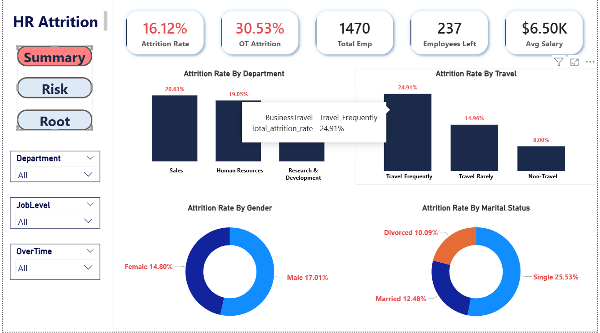
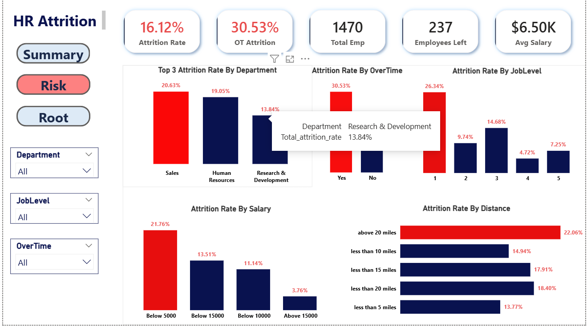
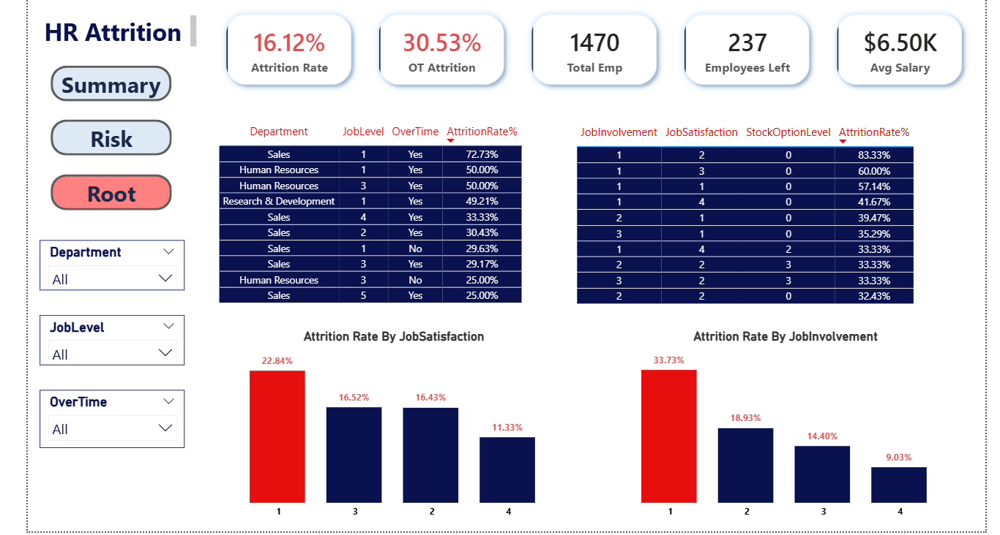

# 👥 HR Attrition Analysis — Employee Retention Intelligence System

## 📌 Project Overview

IBM Corporation HR department is facing an employee attrition rate of 16.12%.
While this appears within industry norms, deeper analysis reveals critical sub-groups
with attrition rates as high as 72.73%. This project identifies the root causes of
employee attrition and provides actionable recommendations through Python EDA,
SQL analysis, and a 3-page interactive Power BI dashboard.

---

## 🔗 Live Dashboard

👉 [View Power BI Dashboard](https://app.powerbi.com/links/_Xmahiro3O?ctid=035ddef6-2433-48b6-8526-70ca8181f76d&pbi_source=linkShare)

---

## 🛠️ Tools Used

| Tool | Purpose |
|---|---|
| Python (Pandas, Matplotlib, Seaborn) | Data cleaning and EDA |
| MySQL | KPI queries and SQL analysis |
| Power BI | Interactive 3-page dashboard |
| DAX | Custom measures and KPIs |
| Git & GitHub | Version control |

---

## 📊 Dashboard Pages

### Page 1 — Executive Summary
- Overall Attrition Rate, Total Employees, Employees Left, Avg Salary
- Attrition by Department, Business Travel, Gender, Marital Status

### Page 2 — Risk Analysis
- Attrition by OverTime, Job Level, Salary Band, Distance from Home
- Top departments by attrition rate

### Page 3 — Root Cause & Recommendations
- Top risk combinations (Department + Job Level + OverTime)
- Attrition by Job Satisfaction and Job Involvement
- Dynamic stakeholder recommendations based on slicer selection

---

## 🔍 Key Findings

- ❌ Overall attrition rate is **16.12%** — but hides critical sub-group problems
- 🔥 **Sales + Job Level 1 + OverTime → 72.73% attrition** — highest risk group
- ⏰ **OverTime is the #1 driver** — OT employees leave 3x more (30.53% vs 10.44%)
- 💰 **Low income (<$5K) employees** have 21.76% attrition vs 3.76% for high earners
- 👤 **Single employees** leave at 25.53% vs 12.48% for married
- 📉 **Job Level 1** has 26.34% attrition — drops sharply at Level 2+
- 🎯 **Performance Rating has zero impact** on attrition (correlation: 0.003)
- 🏢 **Sales department** bleeds at every job level — structural problem confirmed

---

## 💡 Recommendations

1. **Reduce OverTime** for Level 1 employees — biggest single ROI action
2. **Offer Stock Options** to early-career staff — builds loyalty and retention
3. **Faster promotion path** for Job Level 1 — 26.34% currently leave
4. **Fix Sales department** structure — review targets, travel load, and pay
5. **Improve Job Involvement** programs — disengaged employees leave 3x more
6. **Review salary** for Below $5K band — salary adjustment reduces exit risk

---

## 📁 Project Structure
HR-Attrition-Analysis-Python-SQL-PowerBI/
├── documents/
│   ├── HR_Attrition_Project_Brief.pdf
│   └── HR_Data_Dict_Metadata.xlsx
│
├── O_raw_data/
│   └── WA_Fn-UseC_-HR-Employee-Attrition.csv
│
├── powerbi/
│   └── hr.pbix
│
├── python/
│   └── Hr_notebook.ipynb
│
├── screenshots/
│   ├── summary.png
│   ├── Risk.png
│   └── Root.png
│
└── README.md

---

## 📸 Dashboard Screenshots

### Page 1 — Executive Summary

### Page 2 — Risk Analysis

### Page 3 — Root Cause & Recommendations

---

## 👥 Who Is Leaving — Attrition Profile

| Factor | High Risk Group | Attrition Rate |
|---|---|---|
| Job Role | Sales Representative | 39.76% |
| OverTime | Yes | 30.53% |
| Age Group | 18–26 | 34.57% |
| Job Level | Level 1 | 26.34% |
| Marital Status | Single | 25.53% |
| Stock Options | None (Level 0) | 24.41% |
| Salary Band | Below $5,000 | 21.76% |

---

## 📂 Dataset

**IBM HR Analytics Employee Attrition & Performance**
- Source: [Kaggle](https://www.kaggle.com/datasets/pavansubhasht/ibm-hr-analytics-attrition-dataset)
- 1,470 employees | 35 columns | No nulls | No duplicates

---

## 👤 Author

Chandu
GitHub: [@Chandu951513](https://github.com/Chandu951513)

---

## 📃 License

This project is for portfolio and educational purposes only.
IBM HR Analytics dataset is a fictional dataset provided for educational use.

